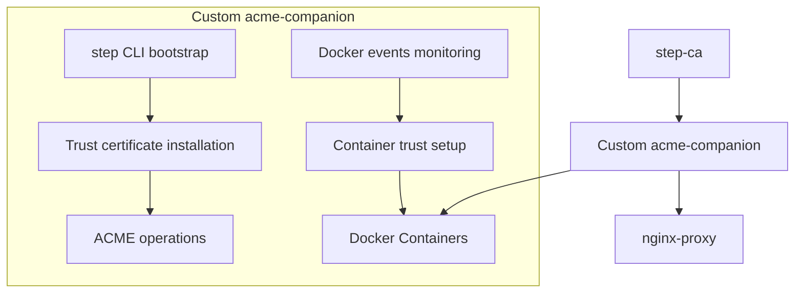

# 🔐 Step-CA Companion (nginxproxy/acme-companion)

Custom image based on `nginxproxy/acme-companion` with automatic step-ca integration through step CLI bootstrap.

## 📋 Description

This image extends the standard `nginxproxy/acme-companion` with automatic trust establishment to step-ca, enabling the use of a private CA for issuing ACME certificates.

## 🔗 Dependencies

This companion is designed to work with:

- **[nginx-proxy](https://github.com/nginx-proxy/nginx-proxy)**: Reverse proxy with HTTP-01 challenge support
- **[nginxproxy/acme-companion](https://github.com/nginx-proxy/acme-companion)**: Base ACME client functionality
- **step-ca**: Private certificate authority with ACME provisioner

## 🌐 DNS Requirements

For proper operation, you need:

- **DNS Server**: Configure your DNS server to redirect your chosen top-level domain to the host address
- **DNS Client**: Configure containers to use your DNS server
- **nginx-proxy**: Must listen on ports 80 and 443 of the host for HTTP-01 challenge validation

### Docker-based DNS Servers

- **[zyrakq/docker-unbound](https://github.com/zyrakq/docker-unbound)**: Unbound DNS server
- **[zyrakq/unbound-stack](https://github.com/zyrakq/unbound-stack)**: Unbound configuration example
- **[jpillora/docker-dnsmasq](https://github.com/jpillora/docker-dnsmasq)**: DNSMasq DNS server

Example DNS configuration:

```ini
*.local -> 192.168.1.100  # Your Docker host IP
```

## ✨ Key Features

- **🔄 Automatic Discovery**: Automatically finds step-ca container
- **🛡️ Automatic Trust**: Establishes trust through step CLI bootstrap
- **📦 Full Compatibility**: Maintains all nginxproxy/acme-companion functionality
- **🔧 Flexible Configuration**: Supports manual and automatic configuration
- **🐳 Container Trust**: Automatic trust certificate installation in Docker containers
- **⚡ Event-Driven**: Real-time monitoring of Docker container events

## 🚀 Usage

### Basic Certificate Generation for Docker Containers

```yaml
services:
  my-app:
    image: nginx:alpine
    environment:
      - VIRTUAL_HOST=myapp.local          # For nginx-proxy
      - LETSENCRYPT_HOST=myapp.local          # For ACME certificate
      - LETSENCRYPT_EMAIL=admin@myapp.local   # Email (optional)
    networks:
      - step-ca-network
```

### Trust Certificate Installation in Docker Containers

For Docker containers that need to communicate with other containers via HTTPS:

```yaml
services:
  # Client that periodically checks server health
  health-checker:
    image: alpine:3.18
    environment:
      - STEP_CA_TRUST=true
    command: |
      sh -c "
        apk add --no-cache curl &&
        while true; do
          echo \"[$(date)] Checking server health...\"
          if curl -s https://api.local/health > /dev/null 2>&1; then
            echo \"[$(date)] ✅ Server is healthy\"
          else
            echo \"[$(date)] ❌ Server health check failed - SSL verification error\"
          fi
          sleep 30
        done
      "
    networks:
      - step-ca-network
    depends_on:
      - api-server
  
  # API server with SSL certificate
  api-server:
    image: nginx:alpine
    environment:
      - VIRTUAL_HOST=api.local
      - LETSENCRYPT_HOST=api.local
    networks:
      - step-ca-network
```

### Complete Stack Example with nginx-proxy

Since step-companion is designed to work exclusively with nginx-proxy and step-ca, here's a complete docker-compose example:

```yaml
version: '3.8'

services:
  # Step-CA Certificate Authority
  step-ca:
    container_name: step-ca
    image: smallstep/step-ca:latest
    environment:
      - DOCKER_STEPCA_INIT_NAME=Local Step CA
      - DOCKER_STEPCA_INIT_DNS_NAMES=step-ca,localhost
      - DOCKER_STEPCA_INIT_ACME=true
      - DOCKER_STEPCA_INIT_REMOTE_MANAGEMENT=true
    volumes:
      - step-ca-data:/home/step
    networks:
      - step-ca-proxy-tier
    ports:
      - "9000:9000"
    healthcheck:
      test: ["CMD", "step", "ca", "health", "--ca-url=https://localhost:9000"]
      interval: 30s
      timeout: 10s
      retries: 3
      start_period: 10s

  step-ca-proxy:
    container_name: step-ca-proxy
    image: nginxproxy/nginx-proxy:latest
    ports:
      - "80:80"
      - "443:443"
    labels:
      com.github.jrcs.letsencrypt_nginx_proxy_companion.nginx_proxy: "true"
    volumes:
      - step-ca-vhost:/etc/nginx/vhost.d
      - step-ca-certs:/etc/nginx/certs:ro
      - step-ca-html:/usr/share/nginx/html
      - /var/run/docker.sock:/tmp/docker.sock:ro
    networks:
      - step-ca-proxy-tier
      - step-ca-network

  step-ca-companion:
    container_name: step-ca-companion
    build:
      context: ./src/step-ca-companion/app
      dockerfile: Dockerfile
    environment:
      ACME_CA_URI: https://step-ca:9000/acme/acme/directory
      ACME_STAGING: false
      STEP_CA_CONTAINER_NAME: step-ca
      STEP_CA_BOOTSTRAP_TIMEOUT: 300
      CRON_ENABLED: true
      CRON_SCHEDULE: "0 */6 * * *"
      CRON_LOG_LEVEL: 2
    restart: always
    depends_on:
      step-ca:
        condition: service_healthy
      step-ca-proxy:
        condition: service_started
    volumes:
      - step-ca-acme:/etc/acme.sh
      - step-ca-vhost:/etc/nginx/vhost.d
      - step-ca-certs:/etc/nginx/certs
      - step-ca-html:/usr/share/nginx/html
      - /var/run/docker.sock:/var/run/docker.sock:ro
    networks:
      - step-ca-proxy-tier

    

  # Example application with automatic SSL
  my-app:
    image: nginx:alpine
    environment:
      - VIRTUAL_HOST=myapp.local
      - LETSENCRYPT_HOST=myapp.local
    networks:
      - step-ca-network

volumes:
  step-ca-data:
    name: step-ca-data
  step-ca-acme:
    name: step-ca-acme
  step-ca-vhost:
    name: step-ca-vhost
  step-ca-certs:
    name: step-ca-certs
  step-ca-html:
    name: step-ca-html

networks:
  step-ca-proxy-tier:
    name: step-ca-proxy-tier
    driver: bridge
  step-ca-network:
    name: step-ca-network
    driver: bridge
```

## 🌐 Remote Context DNS Configuration

When deploying on a remote host (accessed via Docker context), where the certificate authority needs to resolve virtual addresses and issue certificates for them, you may need to deploy a simplified DNS server that only serves Docker containers, not the host client.

### When DNS Configuration is Required

- **Remote Docker context**: Working with Docker on a different host
- **Virtual domain resolution**: step-ca needs to resolve domains like `*.local` for certificate validation
- **Container-only DNS**: Simplified setup where only Docker containers use the DNS server
- **No host DNS setup**: When you don't want to configure DNS client on the host itself

### When DNS Configuration is NOT Required

- **Local deployment**: step-ca running on the same host as the client
- **Host DNS configured**: You have already configured DNS client on the host
- **External DNS server**: You have a proper DNS server infrastructure

### Complete Stack Example with DNS Server

```yaml
version: '3.8'

services:
  # DNS Server for Docker containers (remote context only)
  step-ca-unbound:
    container_name: step-ca-unbound
    image: ghcr.io/zyrakq/unbound:latest
    ports:
      - "${DNS_SERVER}:53:53/udp"
      - "${DNS_SERVER}:53:53/tcp"
    environment:
      ACCESS_CONTROL_CUSTOM: ${ACCESS_CONTROL_CUSTOM}
      LOCAL_DOMAINS: ${LOCAL_DOMAINS}
      BLOCK_PRIVATE: ${BLOCK_PRIVATE:-false}
    restart: unless-stopped
    networks:
      - step-ca-proxy-tier

  # Step-CA Certificate Authority
  step-ca:
    container_name: step-ca
    image: smallstep/step-ca:latest
    environment:
      - DOCKER_STEPCA_INIT_NAME=Local Step CA
      - DOCKER_STEPCA_INIT_DNS_NAMES=step-ca,localhost
      - DOCKER_STEPCA_INIT_ACME=true
      - DOCKER_STEPCA_INIT_REMOTE_MANAGEMENT=true
    volumes:
      - step-ca-data:/home/step
    networks:
      - step-ca-proxy-tier
    ports:
      - "9000:9000"
    healthcheck:
      test: ["CMD", "step", "ca", "health", "--ca-url=https://localhost:9000"]
      interval: 30s
      timeout: 10s
      retries: 3
      start_period: 10s
    depends_on:
      - step-ca-unbound

  step-ca-proxy:
    container_name: step-ca-proxy
    image: nginxproxy/nginx-proxy:latest
    ports:
      - "80:80"
      - "443:443"
    labels:
      com.github.jrcs.letsencrypt_nginx_proxy_companion.nginx_proxy: "true"
    volumes:
      - step-ca-vhost:/etc/nginx/vhost.d
      - step-ca-certs:/etc/nginx/certs:ro
      - step-ca-html:/usr/share/nginx/html
      - /var/run/docker.sock:/tmp/docker.sock:ro
    networks:
      - step-ca-proxy-tier
      - step-ca-network
    depends_on:
      - step-ca-unbound

  step-ca-companion:
    container_name: step-ca-companion
    build:
      context: ./src/step-ca-companion/app
      dockerfile: Dockerfile
    environment:
      ACME_CA_URI: https://step-ca:9000/acme/acme/directory
      ACME_STAGING: false
      STEP_CA_CONTAINER_NAME: step-ca
      STEP_CA_BOOTSTRAP_TIMEOUT: 300
      CRON_ENABLED: true
      CRON_SCHEDULE: "0 */6 * * *"
      CRON_LOG_LEVEL: 2
    restart: always
    depends_on:
      step-ca:
        condition: service_healthy
      step-ca-proxy:
        condition: service_started
    volumes:
      - step-ca-acme:/etc/acme.sh
      - step-ca-vhost:/etc/nginx/vhost.d
      - step-ca-certs:/etc/nginx/certs
      - step-ca-html:/usr/share/nginx/html
      - /var/run/docker.sock:/var/run/docker.sock:ro
    networks:
      - step-ca-proxy-tier
    depends_on:
      - step-ca-unbound

  # Example application with automatic SSL
  my-app:
    image: nginx:alpine
    environment:
      - VIRTUAL_HOST=myapp.local
      - LETSENCRYPT_HOST=myapp.local
    networks:
      - step-ca-network
    depends_on:
      - step-ca-unbound

volumes:
  step-ca-data:
    name: step-ca-data
  step-ca-acme:
    name: step-ca-acme
  step-ca-vhost:
    name: step-ca-vhost
  step-ca-certs:
    name: step-ca-certs
  step-ca-html:
    name: step-ca-html

networks:
  step-ca-proxy-tier:
    name: step-ca-proxy-tier
    driver: bridge
  step-ca-network:
    name: step-ca-network
    driver: bridge
```

### Environment Variables for DNS Configuration

```bash
# DNS server IP (usually the Docker host IP)
DNS_SERVER=192.168.1.100

# Access control for DNS queries
ACCESS_CONTROL_CUSTOM=192.168.0.0/16 allow, 172.16.0.0/12 allow, 10.0.0.0/8 allow

# Local domains to resolve to the host
LOCAL_DOMAINS=*.local 192.168.1.100

# Block private IP ranges (optional)
BLOCK_PRIVATE=false
```

### Docker Host DNS Configuration

For remote deployment, configure Docker daemon on the host in `/etc/docker/daemon.json`:

```json
{
  "dns": ["192.168.1.100", "8.8.8.8", "8.8.4.4"]
}
```

**Important**: When `/etc/docker/daemon.json` is properly configured, you don't need to specify DNS settings for individual containers in docker-compose.yml. The daemon configuration applies to all containers automatically.

### Systemd Service Configuration

If the Docker systemd service doesn't include the config file parameter, add it manually:

```ini
[Service]
ExecStart=/usr/bin/dockerd --config-file=/etc/docker/daemon.json
```

After configuration changes, restart Docker daemon:

```bash
sudo systemctl restart docker
```

## 🏗️ Architecture



## ⚙️ Environment Variables

### Main (acme-companion)

- `ACME_CA_URI`: step-ca ACME server URI
- `ACME_STAGING`: Staging mode (false for production)

### step-ca integration (optional)

- `STEP_CA_CONTAINER_NAME`: step-ca container name (auto-detection)
- `STEP_CA_URL`: step-ca URL (auto-detection)
- `STEP_CA_FINGERPRINT`: step-ca fingerprint (auto-detection)
- `STEP_CA_BOOTSTRAP_TIMEOUT`: Bootstrap timeout in seconds (300)

### Cron Configuration

- `CRON_ENABLED`: Enable/disable periodic trust certificate processing (default: `true`)
- `CRON_SCHEDULE`: Cron schedule for trust certificate processing (default: `0 */6 * * *`)
- `CRON_LOG_LEVEL`: Cron daemon log level (default: `2`)

### Container Environment Variables

For containers that need trust certificates:

- `STEP_CA_TRUST`: Set to `true` to install step-ca trust certificate

## 🔍 Automatic step-ca Discovery

### Discovery Priorities

1. **Docker Labels**: `com.smallstep.step-ca`
2. **Environment Variable**: `STEP_CA_CONTAINER_NAME`
3. **Auto-detection**: By environment variables, port 9000, name

### Parameter Retrieval Methods

- **URL**: Formed from discovered container name
- **Fingerprint**: Docker exec → API fallback

### Initialization Process

1. step-ca container discovery
2. URL and fingerprint retrieval
3. step CLI bootstrap with trust establishment
4. Trust certificate monitor startup (Docker events)
5. Standard acme-companion startup
6. Automatic trust installation for containers with `STEP_CA_TRUST=true`

## 📊 Logging

```bash
# View bootstrap logs
docker logs step-ca-companion | grep BOOTSTRAP

# View discovery logs
docker logs step-ca-companion | grep "step-ca container"

# Full logs
docker logs -f step-ca-companion
```

## 🔧 Debugging

### Trust Verification

```bash
# Inside container
docker exec step-ca-companion curl -s https://step-ca:9000/health

# Check fingerprint
docker exec step-ca-companion step certificate fingerprint /home/step/certs/root_ca.crt

# Check trust installation logs
docker logs step-ca-companion | grep TRUST-
```

### Manual Configuration

```yaml
environment:
  STEP_CA_URL: https://step-ca:9000
  STEP_CA_FINGERPRINT: "your-fingerprint-here"
```

## 🐳 Container Trust Certificate Installation

For automatic installation of step-ca trust certificates in Docker containers:

### Basic Usage

```yaml
services:
  my-app:
    image: nginx:alpine
    environment:
      STEP_CA_TRUST: "true"  # Enables automatic trust certificate installation
    networks:
      - step-ca-network
```

### Supported Container Operating Systems

| OS | Package Manager | Certificate Path | Update Command |
|---|---|---|---|
| Ubuntu/Debian | `apt-get` | `/usr/local/share/ca-certificates/` | `update-ca-certificates` |
| Alpine | `apk` | `/usr/local/share/ca-certificates/` | `update-ca-certificates` |
| CentOS/RHEL | `yum` | `/etc/pki/ca-trust/source/anchors/` | `update-ca-trust` |
| Fedora | `dnf` | `/etc/pki/ca-trust/source/anchors/` | `update-ca-trust` |
| Arch Linux | `pacman` | `/etc/ca-certificates/trust-source/anchors/` | `trust extract-compat` |

### How It Works

1. **Event Monitoring**: Monitors Docker container start events
2. **Environment Check**: Detects containers with `STEP_CA_TRUST=true`
3. **OS Detection**: Automatically detects container operating system
4. **Certificate Retrieval**: Gets step-ca intermediate certificate
5. **Package Installation**: Installs `ca-certificates` package if needed
6. **Trust Installation**: Copies certificate and updates trust store
7. **Verification**: Tests HTTPS connectivity to step-ca

### Example: Microservices with Trust

```yaml
services:
  api-gateway:
    image: nginx:alpine
    environment:
      VIRTUAL_HOST: api.local
      STEP_CA_TRUST: "true"  # Can make HTTPS requests to other services
    networks:
      - step-ca-network
  
  user-service:
    image: node:18-alpine
    environment:
      STEP_CA_TRUST: "true"  # Can make HTTPS requests to step-ca signed services
    networks:
      - step-ca-network
  
  database-client:
    image: postgres:15-alpine
    environment:
      STEP_CA_TRUST: "true"  # Can connect to SSL-enabled databases
    networks:
      - step-ca-network
```

## ⏰ Cron Configuration

The step-ca-companion includes a configurable cron job for periodic trust certificate processing. This ensures that containers with `STEP_CA_TRUST=true` maintain valid trust certificates even if they were missed during initial startup or docker-gen monitoring.

### Basic Configuration

```yaml
services:
  step-ca-companion:
    environment:
      CRON_ENABLED: true              # Enable periodic processing
      CRON_SCHEDULE: "0 */6 * * *"    # Every 6 hours (default)
      CRON_LOG_LEVEL: 2               # Cron daemon log level
```

### Custom Schedules

```yaml
# Every 12 hours
CRON_SCHEDULE: "0 */12 * * *"

# Daily at 2 AM
CRON_SCHEDULE: "0 2 * * *"

# Every 30 minutes (for testing)
CRON_SCHEDULE: "*/30 * * * *"

# Disable cron completely
CRON_ENABLED: false
```

### Cron Schedule Format

The `CRON_SCHEDULE` variable uses standard cron format:

```sh
┌───────────── minute (0 - 59)
│ ┌─────────── hour (0 - 23)
│ │ ┌───────── day of month (1 - 31)
│ │ │ ┌─────── month (1 - 12)
│ │ │ │ ┌───── day of week (0 - 6) (Sunday to Saturday)
│ │ │ │ │
* * * * *
```

### Monitoring Cron Jobs

```bash
# Check cron configuration
docker exec step-ca-companion crontab -l

# View cron setup logs
docker logs step-ca-companion | grep CRON-SETUP

# View cron execution logs
docker exec step-ca-companion tail -f /var/log/trust-processor.log
```

## �️ Host Trust Certificate Installation

For automatic installation of step-ca certificate on the host system with multi-user Docker context support:

### Automatic Installation with systemd (Recommended)

```bash
# Install user systemd integration (no sudo required)
./scripts/install-systemd-integration.sh

# Check status
./scripts/install-systemd-integration.sh status

# View logs
journalctl --user -u step-ca-monitor.service -f

# Remove integration
./scripts/install-systemd-integration.sh uninstall
```

**User Systemd Service Features:**

- **User-specific monitoring**: Monitors Docker contexts for current user only
- **Multi-level monitoring**: Docker Events + Context Changes (10s) + Periodic Container Check (30s)
- **User-context certificates**: Certificates named `step-ca-intermediate-<user>-<context>`
- **Group-based permissions**: Uses `step-ca-certs` group for secure certificate management
- **Cross-platform support**: Works on Ubuntu, Debian, Arch Linux, Fedora, RHEL

### One-time Installation (Alternative)

```bash
# Automatic installation (uses current user and Docker context)
./scripts/install-host-trust.sh

# With custom user name
CERT_USER=admin ./scripts/install-host-trust.sh

# With custom container name
STEP_CA_CONTAINER_NAME=my-step-ca ./scripts/install-host-trust.sh

# Install for specific context
docker context use production && ./scripts/install-host-trust.sh
```

### Multi-User Docker Context Support

- **User-context naming**: Certificates are named `step-ca-intermediate-<user>-<context>`
- **Multiple users and contexts**: Different users and contexts can coexist without conflicts
- **Automatic switching**: systemd integration detects context changes for all users
- **User isolation**: Each user-context combination maintains its own certificate

### Requirements

- Docker installed and running
- step-ca container running
- Supported Linux distribution (Ubuntu, Debian, Arch Linux, Fedora, RHEL, CentOS)
- systemd with user service support (for automatic updates)
- sudo privileges (only for group setup and certificate installation)
